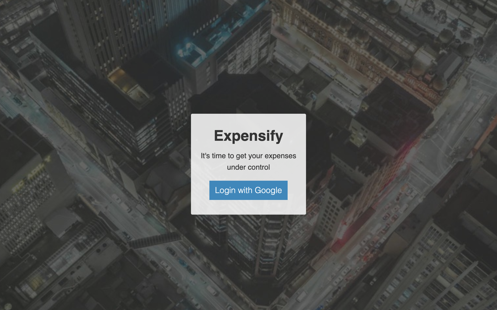
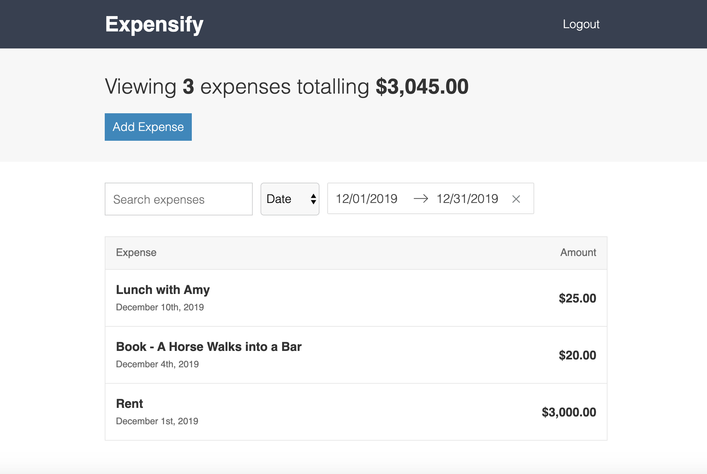

# Expense Management Application

An expense management application written with React and Firebase. Track your expenses month by month to make sure you don't overspend.

## Demo

[Click here](https://langer-react-expensify-app.herokuapp.com/) for a working live demo.

## Screenshots

#### Login page


#### Dashboard example


## Prerequisites

1. Open a Firebase account.
2. Clone this repo and add an environment variables files in the root of the project directory. There are three types of files:
   * .env.development - A file for development environment
   * .env.test - A file for test environment
   * .env.production - A file for production environment

    **These files include sensitive information and you should never commit any of them**

    *File format*
    ```
    FIREBASE_API_KEY=<FIREBASE_API_KEY>
    FIREBASE_AUTH_DOMAIN=<FIREBASE_AUTH_DOMAIN>
    FIREBASE_DATABASE_URL=<FIREBASE_DATABASE_URL>
    FIREBASE_STORAGE_BUCKET=<FIREBASE_STORAGE_BUCKET>
    FIREBASE_MESSAGING_SENDER_ID=<FIREBASE_MESSAGING_SENDER_ID>
    FIREBASE_APP_ID=<FIREBASE_APP_ID=>
    FIREBASE_MEASUREMENT_ID=<FIREBASE_MEASUREMENT_ID>
    ```
3. Port is set by default to port 3000. If you want to run the application on a different port, set a `PORT` environment variable manually (and not in the files).

## Installation

In the project directory run `yarn install` to install all the dependencies.

## Build

The application use a custom Webpack configuration. The build commands for development and production generate the `bundle.js` and `styles.css` files and the source maps for each file. You can find these files under `public/dist/`.

### Development Build
In the project directory run `yarn run build:dev` to build the project.

### Production Build
In the project directory run `yarn run build:prod` to build the project.

## Usage

In the project directory run `yarn run start` to start the application. You should now be able to access it from `http://127.0.0.1:<PORT>/`. IF you didn't confiugred the PORT environment variable, the default port is 3000.

## Tests

In the project directory run `yarn run test`.

## Credits

This application was written as part of Andrew Mead's "The Complete React Developer Course" course.